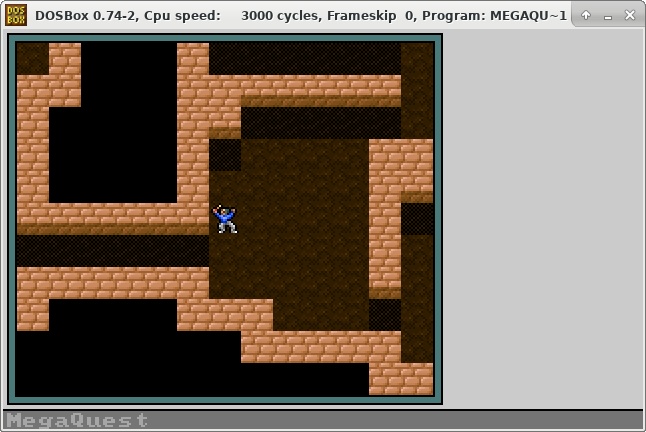

# MegaQuest #

This my attempt to create a roguelike game when I was still in high school. Built using Borland C++ Builder 5 to run in
MS-DOS. Uses VGA mode 13h graphics (320x200 pixels, 256-color) and is a great example of how not to make a game engine.

As it's far more hassle than it's worth to compile on modern systems, you can [download](megaquest.zip) a vintage
executable (dated March 8th, 2002) if you want to run it in DOSBox or something.

